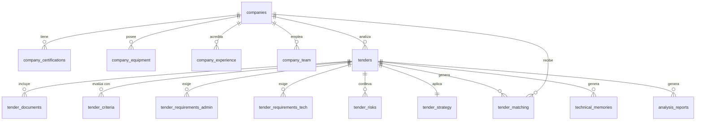

# Pliego Smart AI

Pliego Smart AI es una plataforma SaaS premium e inteligente diseñada para optimizar y automatizar el análisis de pliegos de contratación pública (licitaciones) y la preparación de ofertas para empresas licitadoras. Mediante el uso de inteligencia artificial, la plataforma compara los requisitos de los pliegos con el perfil y capacidades de la empresa, calcula la viabilidad del contrato y genera la documentación técnica necesaria.

---

## 🚀 Características Principales

### 1. Panel de Control (Dashboard)
- Vista unificada de licitaciones activas, estados de los análisis e historial de proyectos.
- Métricas clave de rendimiento como la tasa de éxito estimada y volumen de licitaciones analizadas.
- Acceso directo a las acciones rápidas del sistema.

### 2. Gestión de Perfil de Empresa (Company Profile)
Información detallada estructurada en pestañas para evaluar la idoneidad frente a licitaciones:
- **General**: Datos fiscales (CIF), sectores de actividad, facturación anual, patrimonio neto y clasificaciones empresariales.
- **Certificaciones**: Certificaciones ISO y sectoriales de la empresa con fechas de vencimiento y ponderación de puntos.
- **Equipo**: Personal de la empresa con cargos, titulaciones, años de experiencia y certificaciones individuales.
- **Equipo y Maquinaria**: Inventario técnico y recursos físicos disponibles con estado de conservación y tipología.
- **Experiencia**: Historial de proyectos previos, importes facturados y clientes (públicos/privados) para acreditar solvencia técnica.

### 3. Análisis Automatizado de Pliegos
- **Carga de PDFs**: Subida y procesamiento de los pliegos de prescripciones técnicas (PPT) y cláusulas administrativas (PCP).
- **Extracción de Requisitos**:
  - **Administrativos**: Identificación de criterios de exclusión obligatorios, solvencia económica y normativa aplicable.
  - **Técnicos**: Detección de experiencia mínima requerida, equipo mínimo exigido y medios técnicos necesarios.
- **Evaluación de Riesgos**: Clasificación de riesgos potenciales identificados en el pliego y propuestas de mitigación.

### 4. Inteligencia de Emparejamiento (Tender Matching)
Cálculo automatizado de tres índices predictivos fundamentales para la toma de decisiones:
- **IAT (Índice de Adecuación Técnica)**: Mide el nivel de coincidencia entre las capacidades técnicas de la empresa y las exigencias del pliego.
- **IRE (Índice de Riesgo de Exclusión)**: Evalúa la probabilidad de ser excluido del proceso debido al incumplimiento de cláusulas administrativas u obligatorias.
- **PEA (Probabilidad Estimada de Adjudicación)**: Cálculo predictivo ponderado que combina la solvencia técnica, económica y la estrategia competitiva.

### 5. Simulador Económico
- Simulación interactiva de ofertas económicas.
- Análisis de rentabilidad, márgenes de beneficio e impacto en la puntuación final según las fórmulas del pliego.

### 6. Generador de Memorias Técnicas
- Generación asistida por IA de la propuesta técnica (Memoria Técnica) estructurada según los sectores y las exigencias específicas del concurso.

### 7. Panel de Administración y Configuración
- Gestión de usuarios y asignación de roles (`admin`, `user`).
- Gestión de planes de suscripción (`starter`, `professional`, `enterprise`).
- Control e histórico de solicitudes de demostración (Demo Requests).

---

## 🛠️ Stack Tecnológico

La aplicación se ha desarrollado con tecnologías modernas que garantizan un rendimiento óptimo y una experiencia de usuario fluida:

### Frontend
- **React 18** + **TypeScript**
- **Vite**: Entorno de desarrollo ultra-rápido.
- **Tailwind CSS**: Framework de diseño utilitario para una interfaz premium.
- **shadcn/ui**: Componentes de interfaz accesibles y estéticamente pulidos basados en Radix UI.
- **Framer Motion**: Micro-animaciones y transiciones de página fluidas.
- **Recharts**: Visualización de métricas y gráficos interactivos de rendimiento.

### Gestión de Estado y Consultas
- **React Router DOM v6**: Enrutamiento declarativo con carga diferida (*lazy loading*) de rutas.
- **@tanstack/react-query**: Control y caché del estado asíncrono para interactuar con la base de datos de forma eficiente.
- **Contextos nativos**: Manejo del estado global de autenticación (`AuthContext`), localización multiidioma (`LanguageContext`) y configuración de divisas (`CurrencyContext`).

### Backend y Base de Datos (Supabase)
- **Supabase**: Backend-as-a-Service que proporciona la base de datos PostgreSQL, autenticación de usuarios, almacenamiento de archivos para pliegos (Storage) y Edge Functions.

---

## 🗄️ Esquema de Base de Datos (Supabase)

El modelo relacional está compuesto por las siguientes tablas principales:



### Detalle de las Tablas Principales

| Tabla | Propósito |
| :--- | :--- |
| `companies` | Almacena los perfiles de empresa (CIF, facturación, sectores, patrimonio neto, etc.). |
| `company_certifications` | Certificaciones de calidad u operativas que posee la empresa (por ej., ISO 9001). |
| `company_equipment` | Inventario de herramientas y vehículos requeridos para justificar solvencia técnica. |
| `company_experience` | Proyectos pasados ejecutados para justificar la experiencia previa en el sector. |
| `company_team` | Fichas del personal calificado asignable a los proyectos. |
| `tenders` | Información general extraída de los pliegos (presupuesto, plazos, clasificaciones, etc.). |
| `tender_documents` | Metadatos y rutas de almacenamiento de los PDFs de pliegos subidos por los usuarios. |
| `tender_criteria` | Criterios evaluables mediante fórmulas matemáticas o subjetivos establecidos en la licitación. |
| `tender_requirements_admin` | Obligaciones administrativas y jurídicas para la admisión de la oferta. |
| `tender_requirements_tech` | Requisitos técnicos mínimos exigidos por el pliego (equipo, personal, solvencia). |
| `tender_risks` | Matriz de riesgos y mitigaciones de exclusión identificados automáticamente. |
| `tender_strategy` | Estrategia técnica y económica sugerida para ganar la adjudicación. |
| `tender_matching` | Resultados de los índices de adecuación (IAT, IRE, PEA) calculados frente a una empresa. |
| `technical_memories` | Borradores e informes finales de memorias técnicas generadas para la licitación. |
| `analysis_reports` | Historial de informes de análisis de pliegos y su estado de procesamiento. |
| `profiles` | Perfiles de usuario enlazados a la autenticación de Supabase con su nivel de suscripción (`plan_tier`). |
| `demo_requests` | Registro de solicitudes de demo del sitio web público. |
| `audit_logs` | Trazabilidad completa de modificaciones en los perfiles y análisis. |

---

## 💻 Desarrollo e Instalación

### Requisitos Previos
- Node.js (v18 o superior)
- npm o [Bun](https://bun.sh/)

### Pasos de Configuración

1. **Clonar el repositorio**:
   ```sh
   git clone <url-del-repositorio>
   cd pliego-smart-ai
   ```

2. **Instalar dependencias**:
   Usando npm:
   ```sh
   npm install
   ```
   O usando Bun:
   ```sh
   bun install
   ```

3. **Variables de Entorno**:
   Crea un archivo `.env` en la raíz del proyecto basándote en la configuración de Supabase:
   ```env
   VITE_SUPABASE_URL=tu_supabase_url
   VITE_SUPABASE_ANON_KEY=tu_supabase_anon_key
   ```

4. **Iniciar el Servidor de Desarrollo**:
   Usando npm:
   ```sh
   npm run dev
   ```
   Usando Bun:
   ```sh
   bun run dev
   ```
   El proyecto estará disponible localmente en `http://localhost:5173`.

---

## 📦 Producción y Despliegue

Para compilar y optimizar la aplicación para producción:
```sh
npm run build
```
Los archivos compilados listos para desplegar en plataformas como Vercel o Netlify se generarán en la carpeta `dist/`.
